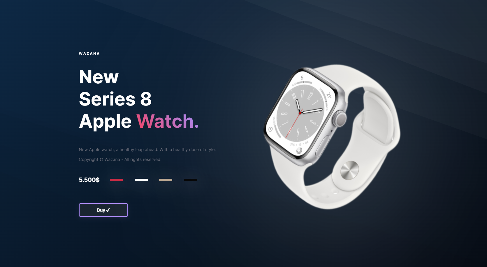

# ~ Projeto inicial: HTML, CSS e JS ~

Projeto de página do Apple Watch Series 8 feita com HTML, CSS, e JS. 
  
#### Conceitos aplicados:
- Como criar seu projeto frontend sem frameworks;
- Responsividade;
- Flexbox/Grid;
- Animações;
- Variáveis CSS;
- Utilizar JS para criar páginas dinâmicas, etc.

#### Observação:
- Projeto criado com propósito de ensino, através do curso "The Next Dev".

#### ~ Preview ~ 
\

